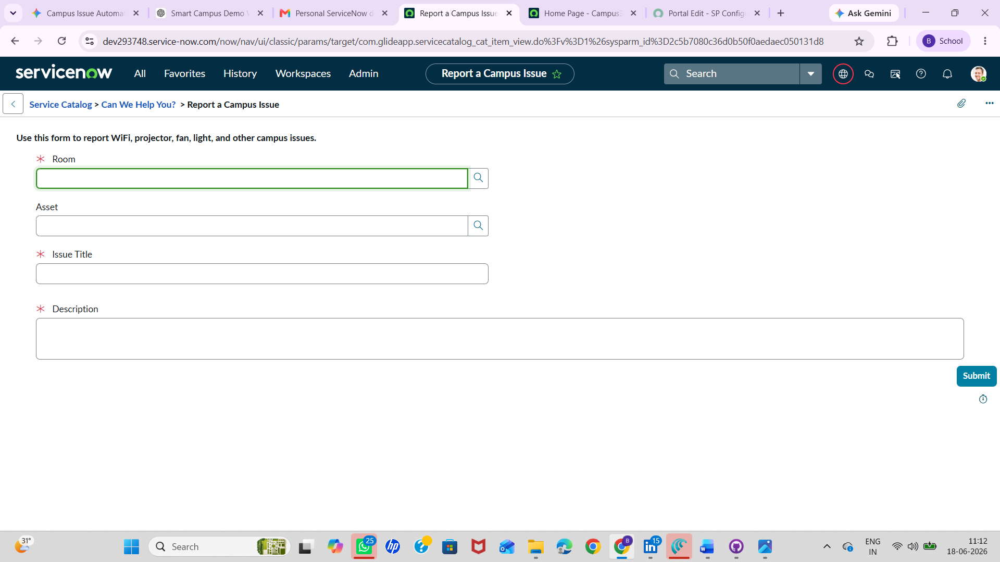
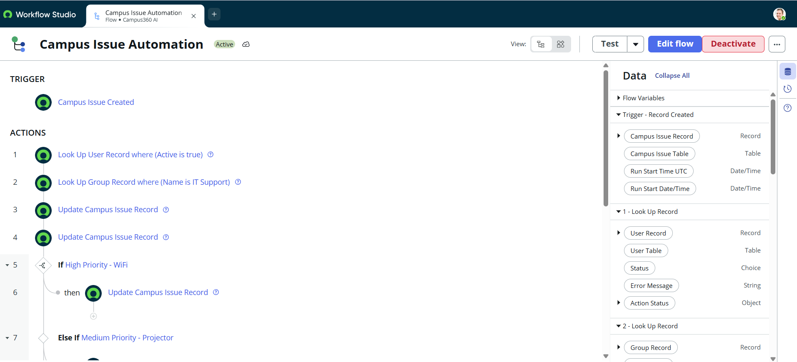
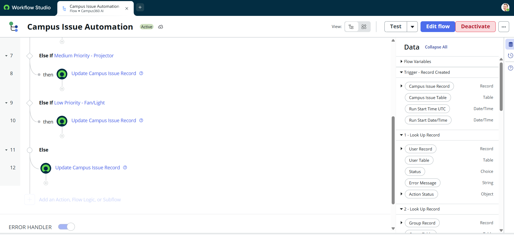
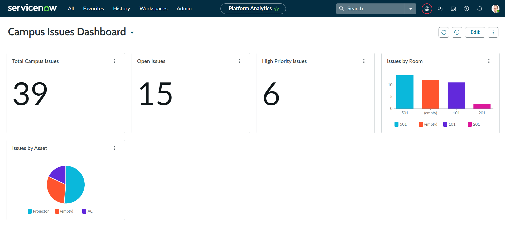
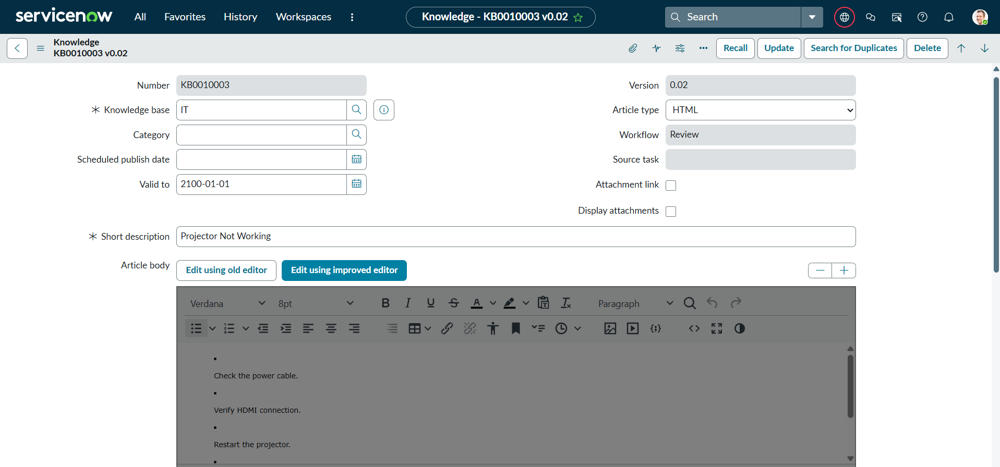
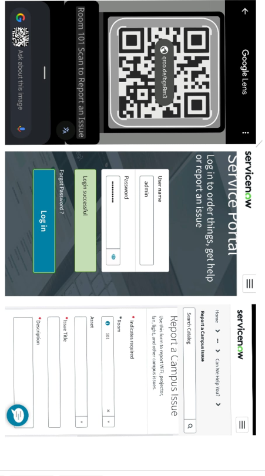

# Smart-Campus-Management-System
ServiceNow-based Smart Campus Management System with QR code-based issue reporting.
# Smart Campus Management System using ServiceNow

## Overview

The Smart Campus Management System is a ServiceNow-based application designed to simplify campus issue reporting and management. Students can report issues through a Service Portal, access knowledge articles, and submit complaints using QR codes placed in different rooms.

## Features

* Custom Campus Tables
* Record Producer for Issue Reporting
* Flow Designer Automation
* Dashboard and Reports
* Knowledge Base Articles
* Mobile-Friendly Service Portal
* QR Code-Based Issue Reporting

## Modules

### Campus Building

Stores building information.

### Campus Room

Stores room details.

### Campus Asset

Stores assets such as projectors and AC units.

### Campus Issue

Stores reported issues.

## Technologies Used

* ServiceNow Studio
* Service Portal
* Flow Designer
* Reports and Dashboards
* Knowledge Base
* QR Code Integration

## Screenshots

### Service Portal Home

### Report Issue Form

### Flow Designer

### Flow Designer - Conditions

### Dashboard

### Knowledge Base

### QR Code and Mobile Reporting

## End-to-End Workflow

Student scans QR code
↓
Mobile-friendly Service Portal opens
↓
Issue form is displayed
↓
Issue record is created
↓
Dashboard and reports are updated
↓
Knowledge articles are available for troubleshooting

## Future Enhancements

* Assignment Group Automation
* Assigned To Automation
* Virtual Agent Chatbot
* AI Categorization

## Author

**Aishwarya Donthi**
